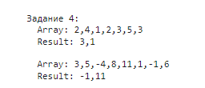

1) **Даны следующие таблицы:** 

   ```
   CREATE TABLE public.departments (
    id integer NOT NULL DEFAULT nextval('departments_id_seq'::regclass),
    created_at timestamp without time zone,
    updated_at timestamp without time zone,
    file_id character varying(32) COLLATE pg_catalog."default",
    CONSTRAINT departments_pkey PRIMARY KEY (id)
   )

   CREATE TABLE public.dep_names (
    id integer NOT NULL DEFAULT nextval('dep_names_id_seq'::regclass),
    name character varying(1024) COLLATE pg_catalog."default" NOT NULL,
    department_id integer,
    name_tsvector tsvector,
    CONSTRAINT dep_names_pkey PRIMARY KEY (id)
   )

   dep_names .department_id (многие) ссылается на departments.id (к одному)
   ``` 
   
   **На основании этих таблиц, выполним следующие запросы:** 

    1.1. Запрос (SELECT) для построения списка departments.id, для которых нет связанных названий (строк в dep_names):

        SELECT dep.id
        FROM public.departments dep
        LEFT JOIN public.dep_names dn ON dep.id = dn.department_id
        WHERE dn.id IS NULL;

    1.2. Запрос (SELECT) для построения списка departments.id, для которых есть 2 и более названий:

        SELECT dep.id
        FROM public.departments dep
        JOIN public.dep_names dn ON dep.id = dn.department_id
        GROUP BY dep.id
        HAVING COUNT(dn.id) >= 2;

    1.3. Запрос (SELECT) для построения списка departments.*, для каждого указать только 1 название (даже если их несколько) с минимальным dep_names.id:

        SELECT d.*, MIN(dn.name) AS name
        FROM public.departments d
        JOIN public.dep_names dn ON dep.id = dn.department_id
        GROUP BY dep.id;

2) **Есть объекты вида:** 

   ```
   {
    id: …integer…,
	  time_stamp: …,
	  parent: …ССЫЛКА НА ВЕРХНИЙ ОБЪЕКТ В ИЕРАРХИИ…,
	  contact: {server: …, email: …, users: [name, …]},
	  addresses: [adress1, …],
   }
   ``` 

   **Создадим структуру таблиц в реляционной БД для хранения этой информации на примере схемы prisma:**  

   ```
   model Object {
    id            Int         @id @default(autoincrement())
    time_stamp    DateTime
    parent        Object?     @relation("ObjectToParent", fields: [parentId], references: [id])
    parentId      Int?
    contacts      Contact[]
    addresses     Address[]
   }

   model Contact {
    id            Int         @id @default(autoincrement())
    server        String
    email         String
    users         String[]
    objects       Object[]    @relation("ObjectToContact")
   }

   model Address {
    id            Int         @id @default(autoincrement())
    address       String
    objects       Object[]    @relation("ObjectToAddress")
   }
   ``` 
   
   -Примечание: В Contact и Address я не указал fields (хранит внешний ключ) и references (целевое поле для внешнего ключа), так как в prisma эти поля явно нужно указывать только в самосвязи. В других же случаях - prisma автоматически обрабатывает создание и управление связями между моделями. Именно поэтому эти поля указываются в модели Object, но не указываются в моделях Contact и Address.

3) **Проверка, что целое число является квадратом, не используя математические функции:** 

   **Я напишу несколько вариантов в зависимости от того, что имеется в виду под математическими функциями. Во всех вариантах - я не использую функции из встроенного объекта Math, так как считаю, что они точно попадают под критерий - математические функции.**  

   **-Первый вариант - оператор \*\*: использование оператора \*\* не считается как использование математических функций:** 

   **-Файл isSquare.option.first.js from ./js/thirdTask/isSquare.option.first.js** 


   ```
   const digit1 = 25;
   const digit2 = 26;

   try {
    isSquare(digit1);
    isSquare(digit2);
   }
   catch (err) {
    console.log(err);
   }

   function isSquare(digit) {
    if (typeof digit !== 'number') {
      throw new Error(`Value ${digit} is not a number`);
    }

    if (isSquareConfirm(digit)) {
      console.log(`Число ${digit} является квадратом`);
    }
    else {
      console.log(`Число ${digit} не является квадратом`);
    }
   }

   function isSquareConfirm(digit) {
    if (digit < 0 || digit % 1 !== 0) {
      return false;
    }

    if ((digit ** (1 / 2)) % 1 === 0) {
      return true;
    }

    return false;
   }
   ```

   -Вывод: 

   ")


   **-Второй вариант - реализация метода Ньютона для x^(2) - n = 0: использование оператора ** считается как использование математических функций (все-таки операторы, так скажем, "под копотом" - это такие же функции):** 

   **-Файл isSquare.option.second.js from ./js/thirdTask/isSquare.option.second.js** 

   ```
   const digit1 = 25;
   const digit2 = 26;

   try {
    isSquare(digit1);
    isSquare(digit2);
   }
   catch (err) {
    console.log(err);
   }

   function sqrt(digit) {
    let x = digit;
    let y = (x + 1) / 2;

    while (y < x) {
      x = y;
      y = (x + digit / x) / 2;
    }

    return x;
   }
   
   function isSquare(digit) {
    if (typeof digit !== 'number' || digit < 0 || digit % 1 !== 0) {
      throw new Error(`Value ${digit} must be a positive integer`);
    }

    const root = sqrt(digit);
    if (root % 1 === 0 && root * root === digit) {
      console.log(`Число ${digit} является квадратом`);
    }
    else {
      console.log(`Число ${digit} не является квадратом`);
    }
   }
   ```

   -Вывод: 

   ") 


   **-Третий вариант - бинарный поиск: прошлые два варианта не подходят:** 

   **-Файл isSquare.option.third.js from ./js/thirdTask/isSquare.option.third.js** 

   ```
   const digit1 = 9;
   const digit2 = 15;
   
   try {
    isSquare(digit1);
    isSquare(digit2);
   }
   catch (err) {
    console.log(err);
   }
   
   function squareRootBinarySearch(digit) {
    let start = 0;
    let end = digit;
    
    while (start <= end) {
      let mid = (start + end) / 2;
      let remainder = mid % 1;

      if (remainder > 0) {
         mid = (start + end) / 2 - remainder;
      }

      if (mid * mid === digit) {
         return mid;
      }
      else if (mid * mid > digit) {
         end = mid - 1;
      }
      else if (mid * mid < digit) {
         start = mid + 1;
      }
    }

    return false;
   }

   function isSquare(digit) {
    if (typeof digit !== 'number' || digit < 0 || digit % 1 !== 0) {
      throw new Error(`Value ${digit} must be a positive integer`);
    }

    if (squareRootBinarySearch(digit)) {
      console.log(`Число ${digit} является квадратом`);
    }
    else {
      console.log(`Число ${digit} не является квадратом`);
    }
   }
   ``` 

   -Вывод: 

   ") 


4) **Функция, которая принимает два аргумента: массив из уникальных целых чисел и сумму в виде целого числа. Если сумма двух любых чисел массива из аргумента равна числу, которое приходит вторым аргументом, функция должна вернуть новый массив из этих двух чисел в любом порядке. Если решения нет, вернуть пустой массив. Текущее число само с собой складывать нельзя:** 

   **-Файл findPairForSum.js from ./js/fourthTask/findPairForSum.js** 

   ```
   let firstArray = [2, 4, 1, 2, 3, 5, 3];
   let secondArray = [3, 5, -4, 8, 11, 1, -1, 6];
   
   const firstArrayUpdated = findPairForSum(firstArray, 4);
   const secondArrayUpdated = findPairForSum(secondArray, 10);
   
   console.log(
    `

    Задание 4:
      Array: ${firstArray}
      Result: ${firstArrayUpdated}

      Array: ${secondArray}
      Result: ${secondArrayUpdated}
    `
   );

   // Основная функция, которая принимает два аргумента:
   // массив из уникальных целых чисел arr и сумму sum в виде целого числа.
   // Функция ищет массиве arr любые два элемента, которые в сумме дают число sum

   function findPairForSum(arr, sum) {
    try {
      arr = findPairForSumValidator(arr, sum); // Пытаемся провести валидацию массива и суммы
    }
    catch (err) {
      // Если валидация прошла неуспешно, то выводим ошибку и возвращаем пустой массив
      console.log(err);
      return [];
    }

    // Ищем в массиве arr любые два элемента, которые в сумме дают число sum,
    // не забывая, что два элемента - это не одно число, и возвращаем массив с ними, если получилось найти
    const arrMemory = {};
    for (let i = 0; i < arr.length; i++) {
      const diff = sum - arr[i];
      if (arrMemory.hasOwnProperty(diff)) {
        return [arr[i], diff];
      }

      arrMemory[arr[i]] = true;
    }

    // Если не смогли найти нужные элементы, то возвращаем пустой массив
    return [];
   }

   // Функция-валидатор для массива и суммы, которые были переданы в функцию findPairForSum.
   // Внутри функции выполняются проверки на определенные условия и бросаются ошибки, если проверки выполнились

   function findPairForSumValidator(arr, sum) {
    // Проверка: значение arr - не массив
    if (!Array.isArray(arr)) {
      throw new Error(`Value ${arr} must be an array`);
    }

    // Проверка: значение sum - не целое число
    if (typeof sum !== 'number' || sum % 1 !== 0) {
      throw new Error(`Value ${sum} must be an integer`);
    }

    // Проверка: массив arr содержит не только числа или содержит
    arr.forEach(value => {
      if (typeof value !== 'number' || value % 1 !== 0) {
        throw new Error(`Array must contain only integers`);
      }
    });

    // Если валидация прошла успешно, то удаляем из массива все дубликаты
    return removeDuplicates(arr);
   }

   // Функция, которая удаляет дубликаты из массива с помощью метода reduce

   function removeDuplicates(arr) {
    return arr.reduce((accumulator, currentValue) => {
      if (!accumulator.includes(currentValue)) {
        accumulator.push(currentValue);
      }

      return accumulator;
    }, []);
   }

   ``` 

   -Вывод: 

    


   -Функция findPairForSum сначала проводит валидацию массива и суммы - нужно убедиться, что переданный массив - это действительно массив, который содержит только целые числа, а также удалить все дубликаты для обеспечения уникальности всех чисел. Также нужно убедиться, что sum - это целое число. Валидация проходит за счет функций findPairForSum и removeDuplicates.

   -Если валидация прошла успешно, то функция findPairForSum приступает к поиску в массиве любых двух элементов, которые в сумме дают число sum, при этом эти два элемента - это не одно и то же число. Для решения данной задачи - я реализовал следующий алгоритм:

    a. Сначала создается объект arrMemory. Он нужен, чтобы запоминать все элементы массива, которые уже были проверены. Благодаря этому - алгоритм использует только один цикл, что дает линейное время выполнения. Если не запоминать все элементы массива, то тогда придется создавать еще один вложенный цикл, что будет давать уже квадратичное время выполнения. Таким образом, алгоритм работает быстрее.

    b. Дальше находится разница между суммой sum и элементом массива на текущей итерации.

    c. Затем идет проверка с помощью hasOwnProperty - если у объекта arrMemory есть свойство, которое названо как получившаяся разница в предыдущем пункте, то это значит, что нашлись два числа, которые в сумме дают переданную сумму sum - это как-раз сама разница и элемент массива текущей итерации. Они и возвращаются как массив, состоящий из этих двух элементов. Если же у объекта arrMemory нет такого свойства, то в arrMemory создастся поле, в котором название - это элемент массива текущей итерации, а значение - true.

    d. Если таких два элемента не было найдено, то вернется пустой массив

   **-Почему данный алгоритм работает:** выполнится один цикл, который пройдет по всем элементам массива. На каждой итерации - текущий элемент будет записан в объект, чтобы его запомнить. Возможно именно этот элемент является решением. Чтобы это узнать - нужно найти другой элемент, который в сумме с запомненным будет давать переданную сумму. Чтобы это сделать - нужно просто на следующих итерациях отнимать от переданной суммы элемент текущей итерации, а дальше просто смотреть - есть ли такая разница в объекте, хранящем все проверенные элементы.

5) **Дан код:** 

   ```
   function func(arr, call_back) {
    if (!Array.isArray(arr) || arr.some(it => parseInt(it) != it || it < 0))
      call_back(null, "Неверный формат входящих данных, должен быть массив положительных чисел");

    let res = [];
    const f = (val) => {
      res.push(val);
      if (res.length == arr.length)
        call_back(res);
    }

    for (let i = 0; i < arr.length; i++) {
      setTimeout(f, arr[i], arr[i]);
    }
   }
   ```

   **-Сначала рассмотрим данную функцию:** 

      -Данная функция принимает два аргумента - массив arr и колбэк call_back. Дальше функция проверяет, что arr - не массив, или в arr есть хотя бы один элемент, который не является положительным числом. Если это проверка выполняется, то вызывается call_back, в который первым парметром передается null, а вторым параметром - сообщение о том, что arr - должен быть массивом положительных чисел.

      -Если же формат входящих данных верный, то создается пустой массив res и анонимная функция f, которая принимает какое-то значение val, дальше оно добавляется в массив res, и происходит проверка - если массив res содержит такое же количество данных, как массив arr, то вызывается call_back, в который передается только один аргумент - массив arr.

      -После анонимной функции - создается цикл, который будет выполняться столько раз, сколько элементов в массиве arr. На каждой итерации - вызывается функция setTimeout, в которую передается три аргумента:

        1. Созданная ранее анонимная функция f в качестве функции, которую нужно выполнить по истечении времени
        2. Элемент массива arr на текущей итерации i в качестве времени задержки в миллисекундах
        3. Элемент массива arr на текущей итерации i в качестве значения, которое нужно передать в функцию f

   **-Отсюда можно утверждать:** 

      a. Функция func работает с асинхронным кодом - принимает в качестве второго аргумента call_back, а как-раз колбэки - это функции, которые передаются в качестве аргумента другой функции и вызываются (или "вызываются обратно") после завершения некоторой операции. Ну и внутри функции func - вызывается неоднократно асинхронная функция setTimeout.

      b. Переданный call_back может принимать два параметра: первый параметр - обязательный и обозначает какой-то результат (по функции func - это либо null, либо массив res). Второй параметр - необязательный (Если валидация входящих данных прошла неуспешно, то мы вызываем call_back с двумя параметрами, а если успешно, то только с одним) и обозначает сообщение о результате.

   **-Общий вывод:** 

      a.Функция func предназначена для того, чтобы продемонстрировать то, как JS работает с асинхронным кодом, то есть показать логику работы Event Loop.

      b.В функции происходит проверка на то, что массив arr содержит только положительные числа, так как задержку в setTimeout можно установить только с помощью положительного числа.

      c.Идея функции заключается в том, чтобы передать в нее массив положительных чисел, которые расположены в хаотичном порядке, например: [44, 0, 5, 73, 32, 1, 2, 66, 3]. А эта функция выведет массив с этими же числами, но уже в отсортированном по возрастанию виде: [0, 1, 2, 3, 5, 32, 44, 66, 73]. Это происходит за счет того, что мы в setTimeout устанавливаем время задержки, равное элементу массива на текущей итерации. А колбэк setTimeout как-раз добавляет этот элемент массива в массив res после окночанию времени задержки.

      d.И когда все элементы массива arr будут добавлены в массив res - мы вызываем call_back. Я могу предположить, что он нужен просто для логирования результата.

      **-Вот так может выглядеть взаимодействие с функцией func:** 

      **-Файл eventLoop.js from ./js/fifthTask/eventLoop.js** 

      ```
      const arr = [44, 0, 5, 73, 32, 1, 2, 66, 3];

      func(arr, (res, message = "Все прошло успешно") => {
        console.log(
          `

          Задание 5:
            Result array: ${res}
            Message: ${message}
          `
        );
      });

      function func(arr, call_back) {
        if (!Array.isArray(arr) || arr.some(it => parseInt(it) != it || it < 0))
          call_back(null, "Неверный формат входящих данных, должен быть массив положительных чисел");

        let res = [];
        const f = (val) => {
          res.push(val);
          if (res.length == arr.length)
            call_back(res);
        }

        for (let i = 0; i < arr.length; i++) {
          setTimeout(f, arr[i], arr[i]);
        }
      }
      ```

      -Данный код выведет в консоль:

      ")

      **-Объяснение почему именно в отсортированном по возрастанию порядке будут выведены все элементы массива:** 

      -JS является однопоточным языком, поэтому чтобы добавить дополнительные потоки для быстрой работы кода - JS использует концепцию Event Loop - бесконечный цикл, в котором JS ожидает задачи, исполняет их и снова ожидает появления новых. То есть задачи поступают на выполнение, JS выполняет их по принципу - первый пришел, первым выполнишься, затем ожидает новые задачи. Может так случиться, что задача поступает, когда движок занят чем-то другим, тогда она ставится в очередь.

      -В данном примере - происходит итерация по всем элементам массива arr. На каждой итерации - вызывается функция setTimeout, которая запишет в массив res элемент текущей итерации через количество миллисекунд, равное элементу текущей итерации. JS выполнит это так:

      -Сначала он добавит первую функцию setTimeout в Call Stack. Но так как эта функция асинхронная, то он перенесет ее колбэк из Call Stack в Web API и удалит эту функцию из Call Stack. Web API будет ждать истечения указанного времени, а пока он ждет - JS запишет в Call Stack вторую функцию setTimeout (это произойдет сразу после того, как первая функция удалится из Call Stack) и дальше все будет то же самое. Когда Web API дождется истечения времени для какой-либо функции setTimeout - JS переместит этот колбэк в Callback Queue. Дальше когда Call Stack будет пустым, JS переместит первый колбэк из Callback Queue в Call Stack. Теперь сам колбэк выполняется и после выполнения - покидает Call Stack и JS перемещает в Call Stack первый элемент из Callback Queue. Все будет так продолжаться, пока весь js код не будет выполнен. Именно за счет этого - все элементы массива выводятся по возрастанию.


   **-Перепишем данный код с помощью:** 

   **a. async/await:** 

   **-Файл eventLoop.asyncAwait.js from ./js/fifthTask/eventLoop.asyncAwait.js** 

   ```
   const arrAsyncAwait = [44, 0, 5, 73, 32, 1, 2, 66, 3];
   
   asyncFunc(arrAsyncAwait).then(([res, message = "Все прошло успешно"]) => {
    console.log(
      `
      
      Задание 5 (async/await):
        Result array: ${res}
        Message: ${message}
      `
    );
   });

   async function asyncFunc(arr) {
    if (!Array.isArray(arr) || arr.some(it => parseInt(it) != it || it < 0))
      return Promise.reject(["Неверный формат входящих данных, должен быть массив положительных чисел"]);
    
    let res = [];
    const promises = arr.map(val => new Promise(resolve => {
      setTimeout(() => {
        res.push(val);
        resolve();
      }, val);
    }));

    await Promise.all(promises);
    return [res, "Все прошло успешно"];
   }

   ``` 

   -Вывод: 

   ") 

   **b. Promise:** 

   **-Файл eventLoop.promise.js from ./js/fifthTask/eventLoop.promise.js** 

   ```
   const arrPromise = [44, 0, 5, 73, 32, 1, 2, 66, 3];
   
   promiseFunc(arrPromise).then((res) => {
    console.log(
      `
      
      Задание 5 (Promise):
        Result array: ${res}
        Message: Все прошло успешно
      `
    );
   }).catch((message) => {
    console.log(
      `
      
      Задание 5 (Promise):
        Result array: null
        Message: ${message}
      `
    );
   });

   function promiseFunc(arr) {
    return new Promise((resolve, reject) => {
      if (!Array.isArray(arr) || arr.some(it => parseInt(it) != it || it < 0)) {
        reject("Неверный формат входящих данных, должен быть массив положительных чисел");
      }

      let res = [];
      const promises = arr.map(val => new Promise(resolve => {
        setTimeout(() => {
          res.push(val);
          resolve();
        }, val);
      }));

      Promise.all(promises).then(() => {
        resolve(res);
      });
    });
   }

   ``` 

   -Вывод: 

   ") 
